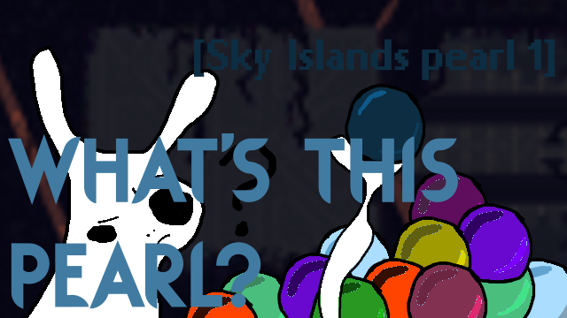

# What's this pearl?



This is a simple mod that shows the current pearl you are holding. 
Just a simple mod I made for myself for sorting through my pearl filled shelter.

Easy download: https://steamcommunity.com/sharedfiles/filedetails/?id=3428753018
Latest release on GitHub: https://github.com/Simyon264/RW-Whats-This-Pearl/releases/latest

# How to compile

1. Clone the repository
2. Run `lib/get_files.py` to copy the necessary files from the Rain World directory. The script tries some common locations for the game, but you can also specify the path to the game's directory if it can't find it.
3. Either open the game in an IDE or use `dotnet build` to compile the mod.
4. Copy the resulting `modinfo.json`, `thumbnail.png` and the `WhatsThisPearl.dll` to the `Rain World\RainWorld_Data\StreamingAssets\mods\whatsthispearl\` folder in the game's directory.
5. If the folder doesn't exist, create it.
6. Run the game and enable the mod in the mod menu.

Resulting structure should look like this:
```plaintext
Rain World
└── RainWorld_Data
    └── StreamingAssets
        └── mods
            └── whatsthispearl
                ├── modinfo.json
                ├── thumbnail.png
                └── plugins
                    └── WhatsThisPearl.dll
```

# How to use

Just hold a pearl, and it will show the pearl's name in the bottom middle of the screen.

# License

This mod is licensed under the MIT License. See the [LICENSE](LICENSE.txt) file for details.

#### :3